# Nano-Megatron `src` 源码组织架构

> 本文描述当前源码的实际结构，而不是未来设计蓝图。分析范围为
> `src/nano_megatron`，依据 Python 导入、公开 API、构造入口和训练控制流整理。
>
> 当前源码包含 15 个顶层子包，以及 `models.gpt`、`nn.kernels`、
> `pipeline_parallel.schedules` 3 个嵌套包。根包 `nano_megatron/__init__.py`
> 只公开版本号。

## 1. 先建立整体心智模型

这个项目最重要的设计特征是“显式装配”：`cli.train` 负责创建配置、分布式运行时、
并行上下文、模型、数据并行策略、数据加载器、checkpoint 和 Trainer；底层模块不从
全局变量中偷偷获取并行状态，而是接收 `ParallelContext` 或更窄的 `ParallelGroup`。

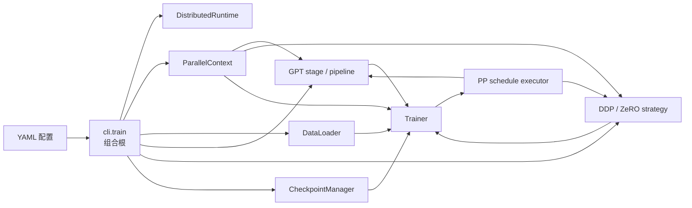

一句话概括各层：

| 层 | 包 | 主要职责 |
|---|---|---|
| 入口与编排 | `cli`, `training` | 装配对象、执行训练 step、恢复与保存 |
| 模型 | `models`, `nn` | GPT 结构、通用 NN 原语、可替换 kernel |
| 并行算法 | `tensor_parallel`, `context_parallel`, `pipeline_parallel`, `data_parallel` | TP/SP、CP、PP、DDP/ZeRO |
| 并行基础设施 | `parallel`, `distributed` | rank 拓扑、进程组、设备与 c10d 生命周期 |
| 配置与数据 | `config`, `tokenizer`, `data` | 强类型配置、文本编码、训练样本 |
| 持久化 | `checkpoint` | 逻辑 shard 描述、manifest、物理保存恢复 |
| 预留 | `utils` | 当前为空壳，尚无共享工具实现 |

## 2. 顶层包之间的依赖关系

### 2.1 可复用库的静态导入图

图中 `A --> B` 表示 A 在运行时导入/使用 B；虚线只画“额外的纯类型依赖”，即导入
位于 `TYPE_CHECKING` 中。`cli` 的扇出很大，因此放到下一张图单独展示。

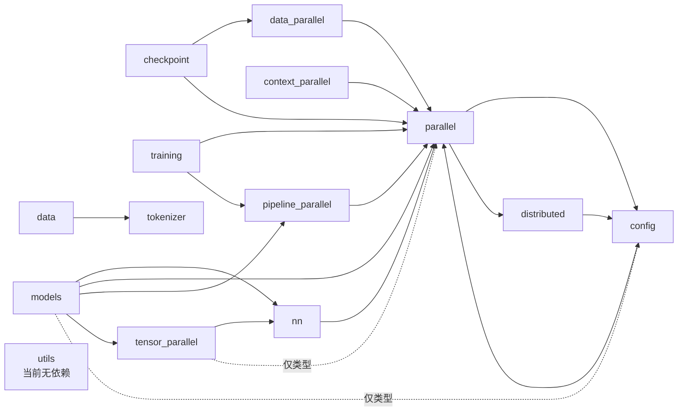

这里最值得注意的是 `config`、`parallel`、`distributed` 的小型导入环：

- `config.schema` 只导入纯数学的 `parallel.axes`；
- `parallel.context` 使用 `config.schema` 和 `distributed.runtime`；
- `distributed.runtime` 接收 `DistributedConfig`；
- `parallel.__init__` 使用延迟导出，避免加载 facade 时立即展开整个环。

因此它不是三套组件互相随意调用，而是由叶子模块和延迟 facade 控制住的依赖环。

完整邻接表如下，便于查图：

| 包 | 运行时导入的项目内包 | 额外的纯类型依赖 |
|---|---|---|
| `checkpoint` | `data_parallel`, `parallel` | — |
| `cli` | `checkpoint`, `config`, `context_parallel`, `data`, `data_parallel`, `distributed`, `models`, `nn`, `parallel`, `tokenizer`, `training` | — |
| `config` | `parallel` | — |
| `context_parallel` | `parallel` | — |
| `data` | `tokenizer` | — |
| `data_parallel` | `parallel` | — |
| `distributed` | `config` | — |
| `models` | `nn`, `parallel`, `pipeline_parallel`, `tensor_parallel` | `config` |
| `nn` | `parallel` | — |
| `parallel` | `config`, `distributed` | — |
| `pipeline_parallel` | `parallel` | — |
| `tensor_parallel` | `nn` | `parallel` |
| `tokenizer` | — | — |
| `training` | `parallel`, `pipeline_parallel` | — |
| `utils` | — | — |

### 2.2 `cli`：集中装配所有包的组合根

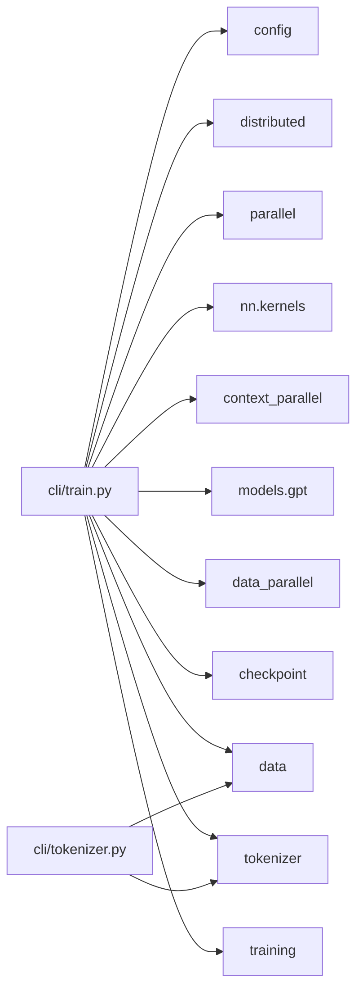

这种高扇出是刻意的：依赖选择集中在程序入口，库内部对象因此可以保持显式、可测试。

## 3. 每个包的内部架构

### 3.1 `config`：强类型配置与集中校验

源码：[`schema.py`](../src/nano_megatron/config/schema.py)、
[`loader.py`](../src/nano_megatron/config/loader.py)、
[`validation.py`](../src/nano_megatron/config/validation.py)

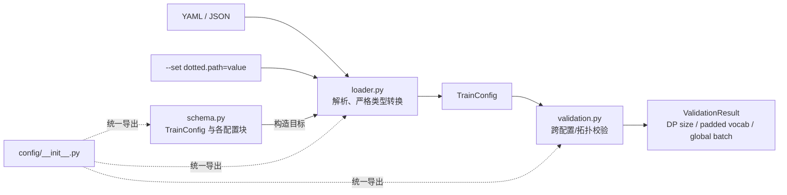

`schema.py` 的 dataclass `__post_init__` 只校验单个配置块；精度、并行维度、数据源、
pipeline schedule 等组合约束统一留给 `validation.py`，避免校验逻辑散落到模型构造器。

### 3.2 `distributed`：`torch.distributed` 生命周期所有者

源码：[`runtime.py`](../src/nano_megatron/distributed/runtime.py)

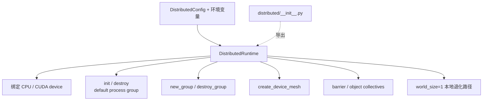

它只负责进程级资源，不定义 TP/PP/CP/EP/DP 的业务语义；后者属于 `parallel`。

### 3.3 `parallel`：五维拓扑、进程组和显式并行上下文

源码入口：[`context.py`](../src/nano_megatron/parallel/context.py)、
[`topology.py`](../src/nano_megatron/parallel/topology.py)、
[`group_plan.py`](../src/nano_megatron/parallel/group_plan.py)

```mermaid
flowchart TB
    AXES["axes.py<br/>TP/PP/CP/EP/DP + coordinate"] --> TOPO["topology.py<br/>rank ↔ 五维坐标"]
    AXES --> PLAN["group_plan.py<br/>GroupSpec / GroupPlan"]
    TOPO --> PLAN
    PLAN -->|展开 rank families| REG["registry.py<br/>确定性创建/复用 communicator"]
    RUNTIME["DistributedRuntime"] --> REG
    REG --> GROUP["group.py<br/>ParallelGroup 值对象"]
    TOPO --> CTX["context.py<br/>ParallelContext"]
    GROUP --> CTX
    PLAN --> CTX

    PLAN --> DOMAINS["domains.py<br/>DENSE / EXPERT 参数域"]
    CTX --> RNG["rng.py<br/>坐标稳定的 RNG streams"]
    LAYOUT["layout.py<br/>调试用 TensorLayout"]
    FACADE["parallel/__init__.py<br/>延迟导出"] -.-> CTX
```

核心构造顺序是：

```text
ParallelContext.create(runtime, config)
  -> ParallelTopology
  -> DEFAULT_GROUP_PLAN.expand(topology)
  -> ParallelGroupRegistry.materialize(...)
  -> 当前 rank 的 ParallelGroup 集合
  -> immutable ParallelContext
```

`GroupPlan` 除五个轴组外，还定义 dense/expert/batch replica、embedding endpoint，
以及两个独立 PP transport channel。`domains.py` 决定参数应该在哪个 replica group
归约；`rng.py` 则让初始化和 dropout 随逻辑坐标稳定。

### 3.4 `nn`：模型无关原语与 kernel 后端

源码：[`activation_checkpoint.py`](../src/nano_megatron/nn/activation_checkpoint.py)、
[`dropout.py`](../src/nano_megatron/nn/dropout.py)、
[`kernels/`](../src/nano_megatron/nn/kernels)

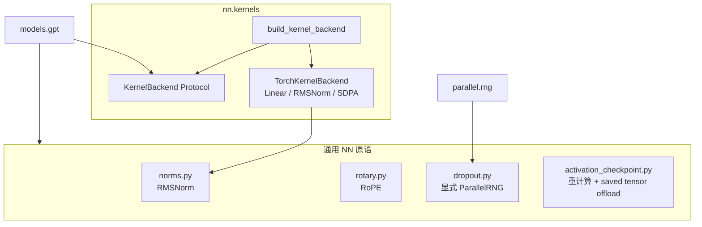

kernel 接口提供 `linear`、`rms_norm` 和无状态 `local_attention`。当前唯一实现是
可读的 PyTorch reference 路径，项目自己的 QKV 投影、RoPE 和并行通信保持显式。

### 3.5 `tensor_parallel`：TP 层与 SP collective

源码：[`sequence_parallel.py`](../src/nano_megatron/tensor_parallel/sequence_parallel.py)、
[`layers.py`](../src/nano_megatron/tensor_parallel/layers.py)、
[`cross_entropy.py`](../src/nano_megatron/tensor_parallel/cross_entropy.py)

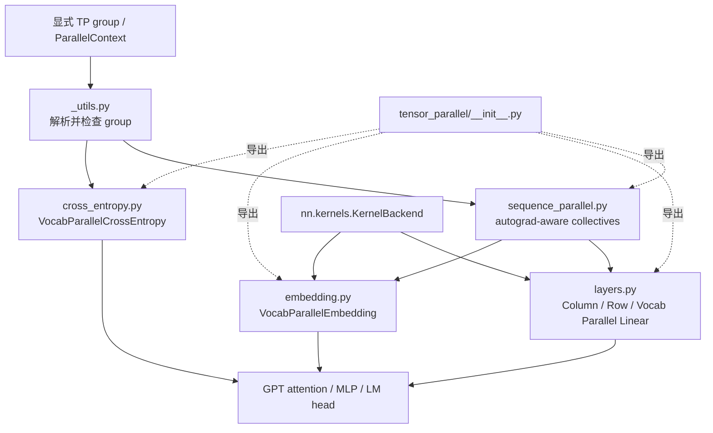

`sequence_parallel.py` 同时提供 TP copy/reduce/gather/scatter 和 SP
all-gather/reduce-scatter，并通过自定义 autograd Function 定义反向通信。
词表并行 loss 只 all-reduce max/sum，不拼出完整 vocab logits。

### 3.6 `context_parallel`：可替换的 CP attention

源码：[`all_gather.py`](../src/nano_megatron/context_parallel/all_gather.py)、
[`ring.py`](../src/nano_megatron/context_parallel/ring.py)

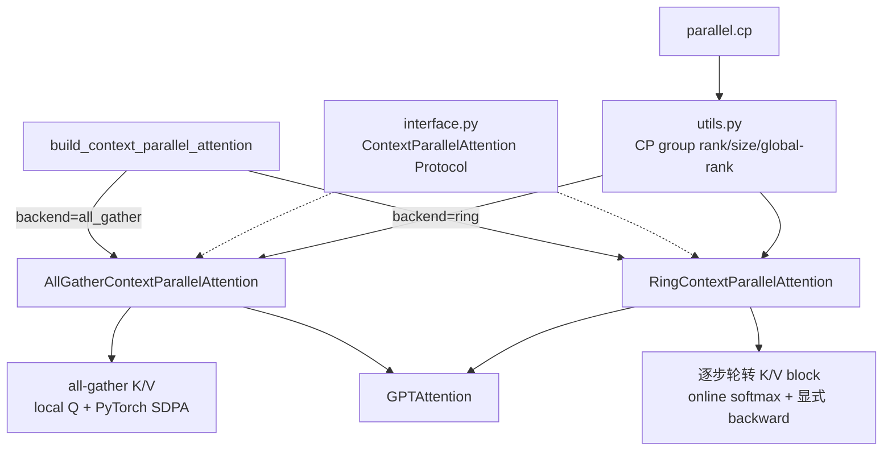

all-gather 路径是清晰的正确性基线；ring 路径限制单步驻留的 K/V 大小，并让 K/V
梯度随 block 绕环累加。当前两条 CP 路径都不支持 attention dropout。

### 3.7 `pipeline_parallel`：划分、P2P、调度计划与统一执行器

源码：[`partition.py`](../src/nano_megatron/pipeline_parallel/partition.py)、
[`p2p.py`](../src/nano_megatron/pipeline_parallel/p2p.py)、
[`schedules/executor.py`](../src/nano_megatron/pipeline_parallel/schedules/executor.py)

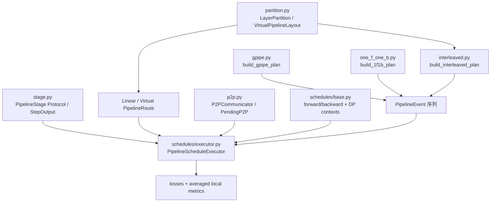

三个 schedule 只负责生成“哪个 microbatch/chunk 在何时 forward/backward”的事件计划；
通信生命周期、graph 配对、DP 同步时机和计算执行都收敛到同一个 executor。

P2P 内部的单帧生命周期是：

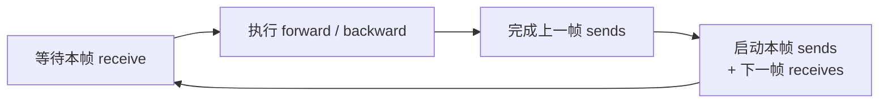

### 3.8 `models`：GPT 组件、模型和 PP builder

当前只有一个模型族 `models.gpt`。源码入口：
[`builder.py`](../src/nano_megatron/models/gpt/builder.py)、
[`model.py`](../src/nano_megatron/models/gpt/model.py)、
[`layer.py`](../src/nano_megatron/models/gpt/layer.py)

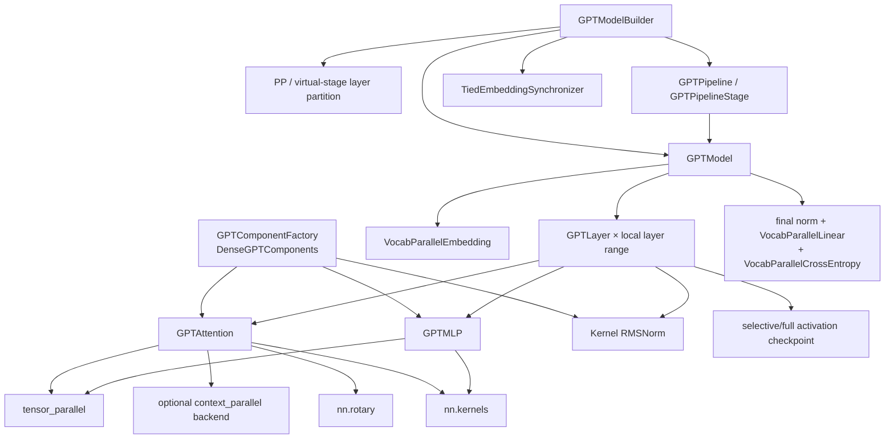

一次 layer forward 的结构是：

```text
hidden
  -> input RMSNorm
  -> TP Q/K/V -> RoPE -> local/CP attention -> TP output projection
  -> residual + deterministic dropout
  -> post-attention RMSNorm
  -> TP SwiGLU MLP
  -> residual + deterministic dropout
```

builder 决定当前 PP rank 只构造哪些 layer，以及一个物理 rank 是否拥有多个 virtual
chunk；模型本身不负责 P2P schedule。

### 3.9 `data_parallel`：统一策略接口下的 DDP 与 ZeRO

源码入口：[`interface.py`](../src/nano_megatron/data_parallel/interface.py)、
[`buckets.py`](../src/nano_megatron/data_parallel/buckets.py)、
[`zero3.py`](../src/nano_megatron/data_parallel/zero3.py)

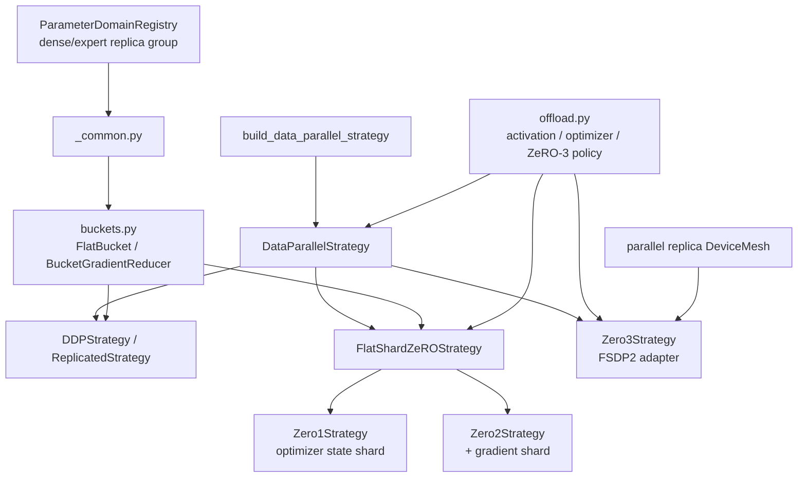

策略向 `Trainer` 暴露同一生命周期：

```text
configure_precision -> setup(model)
-> zero_grad
-> forward_microbatch_context / microbatch_context
-> backward
-> finalize_gradients -> clip_grad_norm -> optimizer_step
-> state_dict / load_state_dict
```

DDP 使用手写 flat bucket all-reduce；ZeRO-1/2 共用可读的 FP32 Adam shard 实现；
ZeRO-3 独立适配 FSDP2，由 FSDP2 管理参数 materialization 和梯度通信。

### 3.10 `training`：batch 路由、microbatch 和训练状态机

源码：[`trainer.py`](../src/nano_megatron/training/trainer.py)、
[`batch_router.py`](../src/nano_megatron/training/batch_router.py)

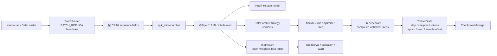

`Trainer` 是控制流中心，但通过 `Any`/窄协议接收 model、DP strategy、checkpoint，
所以静态导入图不会显示它的所有运行时对象依赖。它根据配置创建 PP schedule，单步顺序为：

```text
route batch -> CP shard -> split microbatches
-> schedule.forward_backward
-> DP finalize gradients -> clip -> optimizer step
-> LR scheduler -> global metric aggregation
-> update resumable data cursor -> log / validation / optional checkpoint
```

### 3.11 `checkpoint`：逻辑分片、manifest 与存储后端

源码：[`mapping.py`](../src/nano_megatron/checkpoint/mapping.py)、
[`manifest.py`](../src/nano_megatron/checkpoint/manifest.py)、
[`manager.py`](../src/nano_megatron/checkpoint/manager.py)

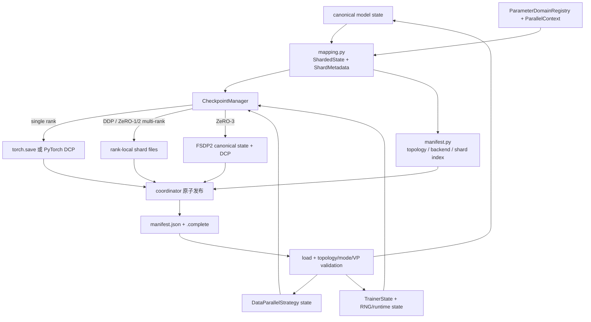

同步和异步路径都遵守“payload 全部成功后才发布 `.complete`”。异步路径先捕获与后续
训练解耦的 CPU snapshot；任何 rank 的后台失败都会汇总成 WORLD 一致的错误。

### 3.12 `tokenizer`：独立 byte-level BPE artifact

源码：[`base.py`](../src/nano_megatron/tokenizer/base.py)、
[`byte_bpe.py`](../src/nano_megatron/tokenizer/byte_bpe.py)、
[`validation.py`](../src/nano_megatron/tokenizer/validation.py)

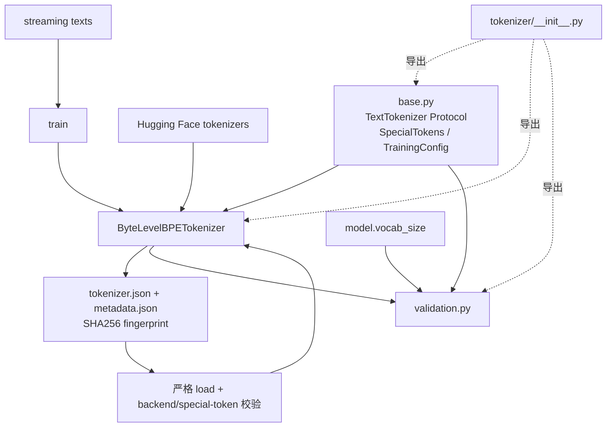

这个包不依赖 Transformers/Datasets。artifact 保存是原子的，并拒绝覆盖非空目录；
普通文本、special token、vocab size 和 fingerprint 都在加载时再次验证。

### 3.13 `data`：文本预处理、corpus、dataset 与 sampler

源码：[`corpus.py`](../src/nano_megatron/data/corpus.py)、
[`mmap_corpus.py`](../src/nano_megatron/data/mmap_corpus.py)、
[`datasets.py`](../src/nano_megatron/data/datasets.py)、
[`loader.py`](../src/nano_megatron/data/loader.py)

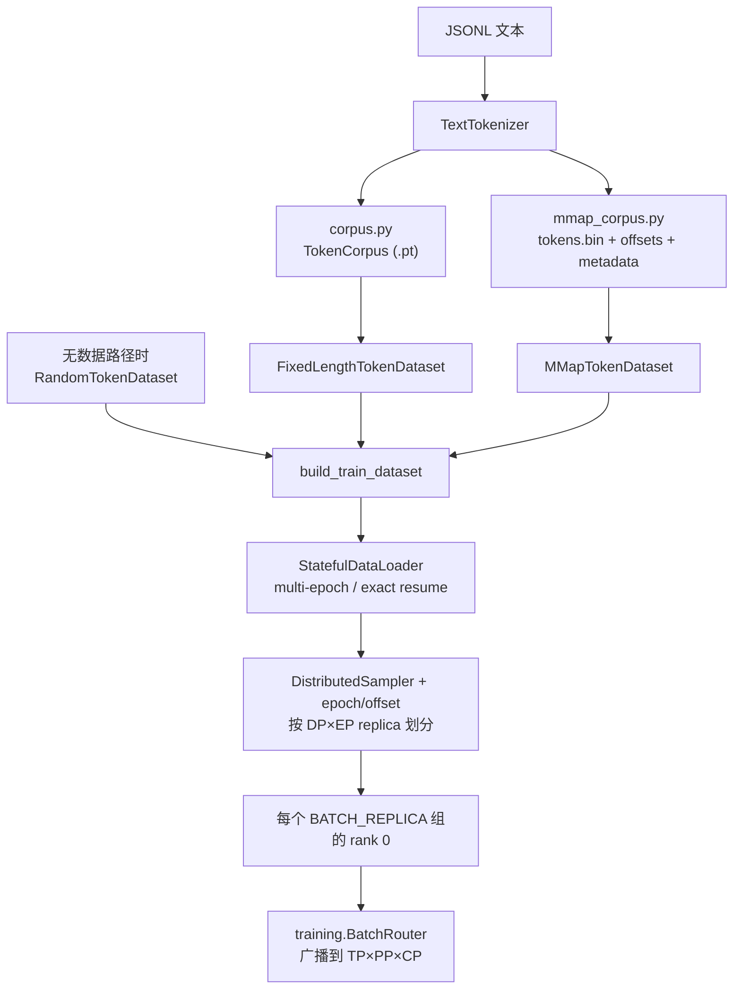

两种真实 corpus 都保存 tokenizer/corpus fingerprint。dataset 用 stride `S` 读取
`S+1` token 窗口生成相邻的 `input_ids`/`labels`；loader 把 sampler seed、shuffle
语义写入 data fingerprint，并只在完整 batch 交给 Trainer 后提交 epoch/global sample
offset，因此 worker prefetch 不会改变 checkpoint 的下一个样本。

### 3.14 `inference` 与 `cli`：训练、预处理、导出和生成

源码：[`train.py`](../src/nano_megatron/cli/train.py)、
[`tokenizer.py`](../src/nano_megatron/cli/tokenizer.py)、
[`export.py`](../src/nano_megatron/cli/export.py)、
[`generate.py`](../src/nano_megatron/cli/generate.py)、
[`inference/artifact.py`](../src/nano_megatron/inference/artifact.py)、
[`inference/generation.py`](../src/nano_megatron/inference/generation.py)

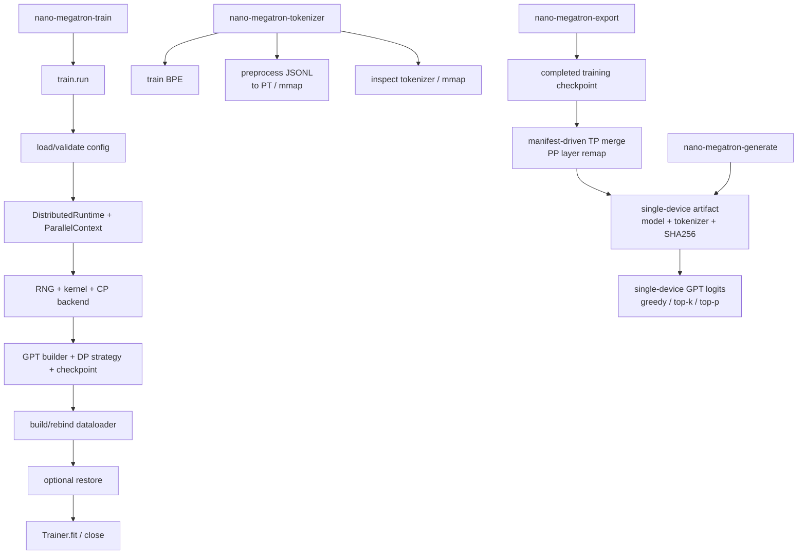

`train.py` 是最适合作为全项目第一阅读入口的文件，因为所有关键依赖都在约 150 行中
按实际启动顺序显式出现。`inference` 不依赖 Trainer/optimizer；它把训练 checkpoint 的
逻辑 shard metadata 转换成 TP1/PP1 core GPT state，并在加载时重新校验 tokenizer 与权重。

### 3.15 `utils`：当前仅为预留包

源码：[`utils/__init__.py`](../src/nano_megatron/utils/__init__.py)

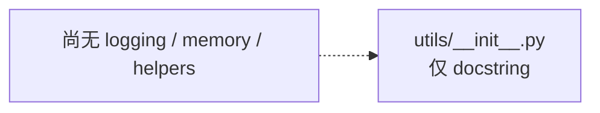

当前没有其他包导入 `utils`。理解现有架构时可以跳过它，也不要把设计文档中规划过的
utility 模块误认为已经实现。

## 4. 推荐源码阅读顺序

如果目标是尽快看懂一次训练如何跑起来，建议沿下面的顺序阅读：

1. [`cli/train.py`](../src/nano_megatron/cli/train.py)：先看所有对象如何装配。
2. [`config/schema.py`](../src/nano_megatron/config/schema.py) 与
   [`config/validation.py`](../src/nano_megatron/config/validation.py)：理解功能开关和边界。
3. [`distributed/runtime.py`](../src/nano_megatron/distributed/runtime.py) 与
   [`parallel/context.py`](../src/nano_megatron/parallel/context.py)：理解 rank/group 从哪里来。
4. [`models/gpt/builder.py`](../src/nano_megatron/models/gpt/builder.py) ->
   [`models/gpt/model.py`](../src/nano_megatron/models/gpt/model.py) ->
   [`models/gpt/layer.py`](../src/nano_megatron/models/gpt/layer.py)：理解本 rank 构造什么模型。
5. `tensor_parallel` 和 `context_parallel`：跟进一个 layer 内的通信。
6. [`training/trainer.py`](../src/nano_megatron/training/trainer.py) ->
   [`pipeline_parallel/schedules/executor.py`](../src/nano_megatron/pipeline_parallel/schedules/executor.py)：
   跟进一次 optimizer step 的控制流。
7. `data_parallel`、`checkpoint`、`data`：最后理解梯度同步、持久化和样本恢复语义。

最关键的三条边界是：模型描述计算结构，schedule 描述跨 stage 的执行顺序，
data-parallel strategy 描述梯度与 optimizer 状态如何同步/分片。三者由 `Trainer`
协调，但彼此没有揉进同一个巨型实现。
